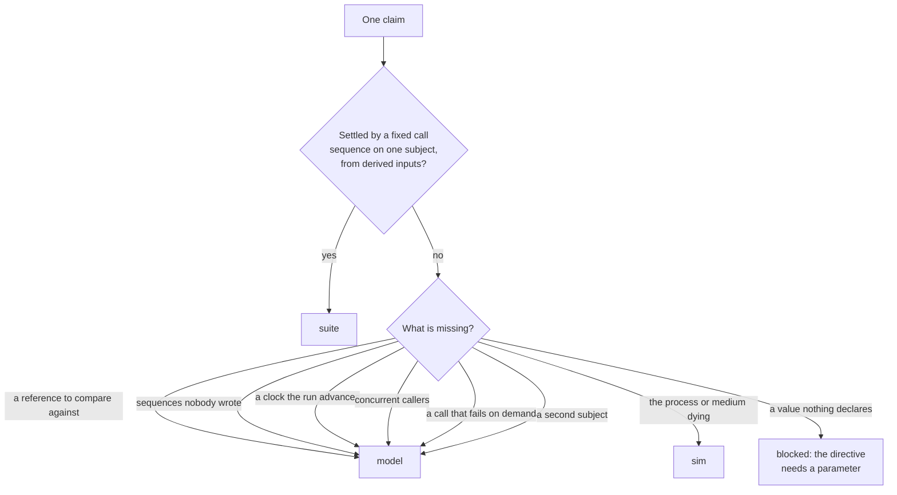

# What each tier owes, per classification

A classification is not owned by a tier. It carries several obligations,
and different tiers own different ones. This register says which
obligations exist, which tier can discharge each, and what is missing.

## The premise this corrects

ADR-0018 said "each classification is owned by exactly one tier".
[ADR-0028](../adr/0028-one-tier-owns-each-obligation.md) supersedes that
line with this register's unit; what follows is the evidence it was
decided on. The shipped code already disagreed, in both directions:

- `ttl` binds a law and is therefore the model tier's. It also emits
  `Read/miss` under `ClassReader`, because `ttl notfound=ErrExpired`
  names what a lapsed read answers and one call settles whether the
  subject answers it. Two tiers, one classification, in generated
  output.
- `bounded` binds a law and is the model tier's. The only check that
  actually holds `boundedtest` to its ceiling is a hand-written suite
  row: write past the capacity, read, count.

That is not a defect in either fixture. It is the register being wrong
about the unit. A classification is a bundle of claims, and the claims
differ in what they need.

The consequence is visible across the corpus. Of the rows consumers
hand-write today, most are the *witnessed* form of a law-backed
classification — `readafterwrite`'s one write and one read,
`deleteremoves`'s delete-then-miss, `stableorder`'s two appends,
`idempotent`'s repeat, `causal`'s store-then-get. Every one is a fixed
sequence on one subject with derived inputs, which is precisely the
suite tier's budget. They are hand-written because ADR-0018 gave the
whole classification to the model tier and left nothing to derive.

## The unit: an obligation

An obligation is one claim, stated in a form some tier can drive. The
question that assigns it is not "whose classification is this" but
**what does this claim need that a caller does not have?**

The same classification reaches this diagram once per claim, and lands
in different places. `ttl` asks it twice: "a lapsed read answers the
declared sentinel" takes the left branch, "an entry stops being readable
once the clock passes its lifetime" needs a clock and takes the right.

## The obligation kinds

Rules are written per kind, not per classification. This is what makes
the work tractable: `sideeffect`, `orderafter`, `validates`,
`readafterwrite` and `deleteremoves` all carry the same obligation under
different member names, and one parameterised body serves them all.

| Kind | The claim | Needs | Tier |
|---|---|---|---|
| **survives** | the call does not panic | nothing | suite |
| **honours the context** | a cancelled, expired or nil context is reported, not ignored | nothing | suite |
| **zeroes beside an error** | every value slot is the zero when the error is non-nil | nothing | suite |
| **the declared answer** | where a directive names a sentinel, a bound or a value, the subject gives it | the directive's parameter | suite |
| **the named pair** | where a directive names a partner member, a fixed sequence over the two holds the stated relation | the directive's parameter | suite |
| **self-agreement** | two calls with nothing observed between them answer alike | nothing | suite |
| **universal** | the claim holds for any sequence, not the one we wrote | generated sequences, shrinking | model |
| **differential** | subject and reference agree after any sequence | a reference implementation | model |
| **temporal** | the claim turns on time passing | a clock the run advances | model |
| **concurrent** | interleavings linearize; readers do not corrupt each other | concurrent drivers, the race detector | model |
| **induced failure** | the claim needs a call that fails on demand | fault injection | model |
| **multi-subject** | the claim is about a group, not an instance | two or more subjects in one relation | model |
| **survival** | the claim holds across a crash, a restart or a partial write | a killable process, a breakable medium | sim |

The first six are the suite tier's whole vocabulary. Anything a rule
wants that is not in that list is somebody else's obligation.

## The register

Every classification, and what each tier claims about it. A dash means
that tier claims nothing — not that the claim is missing, but that no
claim of that kind exists for this classification.

Status is carried inline: **bold** is owed, plain is emitted or, in the
model column, bound to a law. `tiers.LawsFor` is the authority for which
law; the wording here is what the law asserts, not its identifier.

### Detected shapes

| Shape | suite | model | sim |
|---|---|---|---|
| `reader` | a miss answers the declared sentinel, or the zero where something supplies; a hit returns what was seeded | agrees with a reference on every key, after any sequence | — |
| `readernoerror` | a miss reads as the zero; **a hit reads what was written** | as above | — |
| `readerwithbool` | **the flag and the value agree on both arms** | as above | — |
| `lookup` | every slot zeroes on a miss; **every slot is populated on a hit** | as above | — |
| `pointerreader` | nil on a miss; **non-nil on a hit, and the pointer does not alias the subject's state** | as above | — |
| `aggregator` | the count equals what the run seeded | the count tracks the sequence | — |
| `multiaggregator` | every value slot is the zero beside an error | slots agree with the reference | — |
| `multireader` | every value slot is the zero beside an error; **every slot populated on a hit** | as above | — |
| `batchreader` | **the answer follows the question's order; the empty call succeeds** | a batch agrees with N single reads | — |
| `writer`, `compositewriter`, `multiargwriter` | the signature family; the seed derivation's input | writes land, through the readers' laws | — |
| `answeringwriter` | **what the write answers is what a read returns** | agrees with the reference | — |
| `mutator` | the signature family; a void return reports nothing to judge | — | — |
| `predicate` | **agrees with itself** | tracks the state the sequence produced | — |
| `pure` | **agrees with itself, on one receiver and across two** | deterministic over generated inputs | — |
| `closer` | the teardown family | — | — |
| `lifecycle` | the teardown family, no deadline | the transition is valid | — |
| `voidlifecycle` | the smoke alone | — | — |
| `poisonaccessor` | **the state latches: a second read reports what the first did** | — | — |
| `streamreader` | **the sequence stops when the consumer breaks; a cancelled context surfaces on the first yield** | the contents agree with a reference | — |
| `streamconsumer` | — (an interface parameter admits no literal) | — | — |

### Mixins

| Mixin | suite | model | sim |
|---|---|---|---|
| `associative` | **a fold in two groupings agrees** | any grouping, generated | — |
| `atomic` | **a refused write leaves the read unchanged** | observable state around any failing write | — |
| `bounded` | **the reader answers no more than the declared capacity** | the bound holds under any sequence | — |
| `cacheable` | **two reads agree** | cached and uncached agree with a reference | — |
| `causal` | **store then get returns it** | effects observed in causal order | — |
| `commutative` | **two orders agree** | any order, generated | — |
| `concurrent` | — | histories linearize (a leg, not a law) | — |
| `concurrentreaders` | — | **readers do not corrupt each other** | — |
| `conservative` | **a transfer leaves the total** | conserved over any sequence | — |
| `crdtmerge` | **a merge folds a peer in and keeps what was there** | converges in either order | — |
| `defaultonerror` | **a failed read answers the type's default** | differential on the error paths | — |
| `deleteremoves` | **delete, then the read reports the sentinel** | after any sequence | — |
| `deprecated` | nothing, by decision — the obligations survive the deprecation | — | — |
| `errors` | nothing, by ruling — it marks the error returns as contract and licenses nothing falsifiable; the miss is `notfound sentinel=`'s (eidos#43) | — | — |
| `eventually` | **settle, then observe** | convergence after any sequence | — |
| `hooks` | **register a callback, fire, it ran** | — | — |
| `idempotent` | a repeat changes nothing observable | N calls equal one, for any N | — |
| `indexed` | **one past the reported size is not a position; one inside it is** | positions track the collection | — |
| `injectionsafe` | **a control sequence round-trips as data** | — | — |
| `integrationonly` | nothing, by decision — it asks for a build constraint | — | — |
| `leakfree` | **acquire and release balance** | nothing leaks after any sequence | **nothing leaks on an abnormal exit** |
| `lifecycleafterclose` | **work after close is refused** | every method after close | — |
| `monotonic` | **two reads never decrease** | never decreases over any sequence | — |
| `monotonicreads`, `monotonicwrites`, `readyourwrites`, `writesfollowreads` | **write, then the read returns it** | session ordering against a reference | — |
| `nilsafe` | **zero inputs are answered, not panicked on** | — | — |
| `noduplicates` | **a drain yields each element once** | any drain, any sequence | — |
| `notfound` | nothing of its own — the reader shape's rule reads it | — | — |
| `orderafter` | **refused before the prerequisite, accepted after** | — | — |
| `overmatch` | **the drain contains what was added** | containment over any sequence | — |
| `partition` | **vary the axis alone; the first partition reads back unchanged** | nothing crosses the boundary, any sequence | — |
| `permutation` | **the drain matches as a set** | any drain | — |
| `pointintime` | **two reads agree across a write between them** | the snapshot against a reference | — |
| `poisonable` | **induce, and the accessor latches** | sticky across any sequence | — |
| `pure` | **agrees with itself, across two receivers** | deterministic over generated inputs | — |
| `readafterwrite` | **write, then the read returns it** | agrees with a reference after any sequence | — |
| `retrysucceeds` | blocked — no attempt count is declared | — | — |
| `sample` | **what the builder produces, the method accepts** | — | — |
| `scheduled` | — | fires once the clock passes the instant | — |
| `scope` | blocked — no axis is declared | — | — |
| `serializable` | **the history hands back a copy** | no anomaly in any interleaving | — |
| `sideeffect` | **observe, call, observe — and the two differ** | — | — |
| `snapshotisolation` | **the history hands back a copy** | no dirty read, dirty write or read skew | — |
| `stableorder` | **two drains yield the same order** | any two drains | — |
| `sticky` | **one key is served by one instance** | over any sequence | — |
| `streamreflectsmutations` | **an item added mid-range is seen** | any mutation mid-iteration | — |
| `tamperevident` | **corrupt, and verification detects it** | — | **detected after a restart** |
| `timeaware` | — | the answer tracks the clock | — |
| `timeout` | **a subject with no delay answers at once** | the budget is respected on the clock | — |
| `total` | **the domain edge is answered** | every generated input is answered | — |
| `ttl` | a lapsed or absent read answers the declared sentinel | unreadable once the clock passes the lifetime | — |
| `validates` | **the validator and the guarded callable agree** | — | — |
| `windowed` | **an occurrence inside the window counts** | one outside it falls out on the clock | — |
| `wrappedvia` | — | **what it returns unwraps to the cause** | — |
| `xsssafe` | **no bracket survives escaping** | — | — |

### Contracts

| Contract | suite | model | sim |
|---|---|---|---|
| `appender` | **append, then the replay yields it** | append-only grows | — |
| `batchwriter` | **under `all-or-nothing`, one bad record leaves nothing** | any batch, any failure point | — |
| `cas` | **a fresh cell takes version zero; a stale one is refused** | exactly one winner under contention | — |
| `chain` | **an unlinked entry is detected** | the history verifies after any sequence | **detected after a restart** |
| `circuitbreaker` | — | **opens after the declared threshold** | — |
| `codec` | **encode then decode, at the declared fidelity** | the round trip over generated inputs | — |
| `cursor` | **a read after close reports the sentinel** | next-after-close; close is idempotent | — |
| `ifabsent` | **a second write for one key is refused; another key is still accepted** | — | — |
| `ifmatch` | **a stale predicate is declined, and the writer agrees** | — | — |
| `leaderelection` | — | **exactly one leader across a group** | — |
| `lease` | **a held key is refused; a free one is taken** | double-acquire blocks; released on cancel | — |
| `outbox` | **append with nobody listening, attach, the backlog arrives** | at-least-once delivery | **the record survives a crash** |
| `pagination` | **the walk terminates and keys arrive in order** | no duplicates; resumable | — |
| `persister` | **write, then the read returns it** | retrievable after any sequence | — |
| `pool` | **hands out what it holds and no more** | balanced; leak-free | — |
| `publisher` | **an attached subscriber receives what is published** | the declared delivery guarantee | — |
| `ratelimit` | — | inside the burst admitted; refills on the clock | — |
| `saga` | **compensate undoes the step it applied** | full compensation after any prefix | — |
| `singleflight` | **a memoizing subject computes once per key** | coalesces under real contention | — |
| `transaction` | **an erroring body leaves the store as it found it** | atomic over any sequence | — |
| `tx` | **settles once, then refuses both terminals** | two-phase mutex; rollback after commit | — |
| `updater` | **a second write replaces rather than accumulates** | agrees with a reference | — |
| `upserter` | **a repeated write is the same key, not a new one** | agrees with a reference | — |
| `watcher` | **a trigger wakes the watcher of that key and no other** | returns on change | — |
| `workflow` | **a transition out of the last declared state is refused** | valid transitions over any sequence | — |
| `writethroughcache` | — | **the cache and the backing store agree** | — |

Read down the suite column and the shape of the work is plain: the
witnessed form of a law is nearly always statable, and nearly always
missing. Read across a row and ADR-0018's premise fails — `ttl`,
`bounded`, `leakfree`, `chain` and `outbox` each have entries in two or
three columns.

## Waiting on upstream

Each was filed, ruled on, and is additive; none blocks work here. The
pattern behind the first two is a directive describing a relationship
without naming the member a check would call — `sideeffect` was in this
state until it gained `observe=`, and `partition` until `axis=`.

| Classification | What lands | Issue |
|---|---|---|
| `retrysucceeds` | `attempts=`, optional, validated at ≥ 2. The suite declines the law until an author declares a number | [eidos#43](https://github.com/thesm-os/eidos/issues/43) |
| `scope` | `axis=`, optional, matching `partition`, with a host-parameter check. Licenses the isolation half; authorisation stays out of reach of a signature vocabulary | [eidos#43](https://github.com/thesm-os/eidos/issues/43) |
| `accumulates` | a new param-less mixin — the positive form, not a negated `idempotent` | [eidos#44](https://github.com/thesm-os/eidos/issues/44) |
| `batchwriter` | a `reader=` partner **role**, optional, back-stamped as `persister`'s is — not a `read=` param, which records the pairing in one direction only | [eidos#45](https://github.com/thesm-os/eidos/issues/45) |
| `time.Duration`, `time.Time` | a curated stdlib sample table consulted before the resolver gate, each entry carrying its `Ref` so the import registers. Returns `scheduled.At` and `watcher.Next` their derived families | [eidos#42](https://github.com/thesm-os/eidos/issues/42) |

`errors` was in this list and is not: ruled out of scope upstream. A
condition-to-sentinel map would be an encoded graph in an opaque value,
which the resolver cannot check, where the per-condition mixins are one
fact per declaration. `errors` marks the error returns as contract and
owes documentation rather than a check — it moves to the table below.

The negated mixin form was also in this list, wrongly. ADR-0016 rules it
out of the vocabulary for the reason that settles it: a mixin appears
only because someone wrote the directive, so deleting it *is* the
suppression and there is nothing to switch off. `DenyNegation` on the
mixin schema is the substrate agreeing, and stays.

## Owes no check, and why

Recording these keeps them out of the gap count.

| Classification | Why |
|---|---|
| `writer`, `compositewriter`, `multiargwriter` | inputs to the seed derivation, not claims |
| `mutator` | a void return reports nothing to judge, which is also why it is excluded from the seed set |
| `closer` | the teardown's signature family is the whole of it; a second close is `idempotent`'s |
| `notfound` | names *what* a miss reports; the reader shape's rule reads it |
| `deprecated` | a deprecated callable keeps every obligation until it is deleted — skipping it would stop testing a method still in use, and announcing the deprecation would assert nothing |
| `integrationonly` | asks for a build constraint on the emitted file, which is Layout's, not a template's |
| `streamconsumer` | the consumed stream is an interface parameter and no literal writes one |
| `errors` | it marks the error returns as contract rather than "shouldn't happen", which changes how a reader treats them and licenses nothing falsifiable ([eidos#43](https://github.com/thesm-os/eidos/issues/43)) |

## What this changes

**ADR-0018 needs amending.** "Each classification is owned by exactly
one tier" should become "each *obligation* is owned by exactly one
tier", and the gate should measure the union over obligations. The
current wording is why `ttl` and `bounded` ship split while the register
claims otherwise, and why consumers hand-write the witnessed form of
laws.

**The coverage numbers were the wrong unit.** "55 classifications
uncovered" counts classifications; the honest figure counts obligations,
and it is larger — most law-backed classifications also carry an
unwritten suite obligation.

**Composition stops being optional.** If tiers own parts of a
classification, then one package's index and one manifest must be
assembled from several tiers' contributions. That is the pluggable split
already recorded as OWED AT RELINK, and this is the argument for doing
it before writing the owed rules rather than after.

**The rules are fewer than the gaps.** Six obligation kinds cover the
suite tier's whole scope, and the largest owed group — the named pair —
is one parameterised body serving twenty-odd classifications. The work
is not fifty-five rules.
