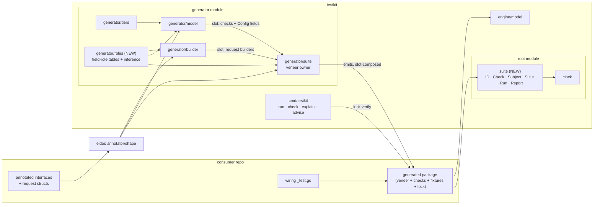
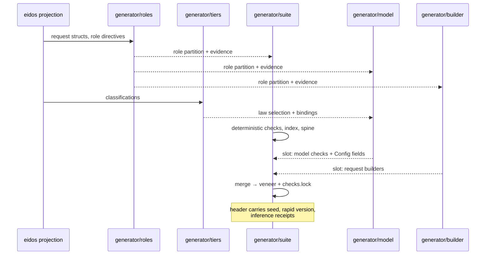

# Suite contract — implementation architecture

How [RFC-0004](../rfc/0004-the-suite-contract.md) lands in this tree: which
component owns which piece, where the seams are, what enforces each invariant,
and in what order the work can merge without a broken intermediate state.

This note exists to get the implementation done and dies when it lands. The
contract itself lives in the RFC; the decisions it forces will live in ADRs
(listed at the end). Nothing here is consumer documentation.

## Result up front

Five components, two of them new. The runtime data model is a new root-module
package with a frozen import list. The veneer is a new emission surface
**owned by `generator/suite`**, with `generator/model` and `generator/builder`
contributing through named slots — the seam that exists today as model
appending closures into suite's private config becomes three slot contracts
over public data. Field-role resolution is a new shared table package beside
`tiers`, consumed by the generator plugins, never by the runtime. The
manifest rides the existing `testkit check` drift machinery. Every RFC
invariant has exactly one enforcement point, and each enforcement point is a
gate or the compiler — never a convention.

Two premises are de-risked by spikes **before** the steps that depend on
them are funded: the hand-built castest veneer (step 1's exit criterion) and
the slot-granularity spike (step 3's entry criterion).

## Components



Two hard dependency rules, both gate-enforced (see the invariant map):

- `suite` imports `testing` and `testkit/clock` and adds **zero module
  dependencies**. Model checks reach `engine/model` by closing over it in
  generated code; the runtime vocabulary stays engine-free.
- `generator/roles` is generator-side only. The runtime never learns what a
  "stream" is; by the time a check value exists, roles have been compiled
  into closures and pool wiring.

### 1 · `suite` (new, root module)

The RFC's data model, verbatim: `ID` (with the grammar), `Class`, `Caps`,
`Check[S]`, `Subject[S]`, `Suite[S]`, `Run`, `Report`. ~450 lines, no state
beyond what `Run` builds per call.

`Run` has three phases, strictly ordered:

1. **Validate** — zero subjects; duplicate subject names; `Without` IDs
   matching no check; hand-built IDs violating the grammar; a `Check`
   setting neither or both of `Run`/`RunWith`; more than one `Oracle`;
   `Merge`/`With` duplicate IDs. All failures name the known set. Nothing
   has executed yet.
2. **Execute** — `t.Run(subject)` → `t.Run(string(id))`, `t.Parallel` at
   both levels (the corpus's current parallelism), **except subjects with
   `Serial: true`**, which run in declaration order after the parallel
   group. Capability resolution happens per (check, subject) here:
   `Needs.Clock` with nil `OnClock`, `Needs.Induce` with no inducer,
   `RunWith`-checks against a subject lacking the constructors they name —
   each produces the red-with-fix failure from one message template that
   lives here, once, not per veneer.
3. **Report** — assembled under a mutex during execute, **emitted from a
   `t.Cleanup` registered on the parent test**: parallel subtests outlive
   the parent's function body, so a body-position log would print an empty
   report; Cleanup runs after all subtests complete. A gate test with a
   deliberately parallel suite pins this. The `Report` struct is the
   source; its JSON encoding is versioned (`testkit-report v1`,
   additive-only) and golden-filed; the text rendering in the log is a view.

Testing: the package is hand-written and hand-tested (the circularity rule —
the thing that runs generated checks is not itself generated). `Rejects`
drives its failure paths.

### 2 · Veneer emission (`generator/suite` owns, three slots)

Today model reaches into suite's output via `extensions` on the private
config — the seam where the dropped-`opts` and invisible-clock defects
lived. That seam becomes three named slots in the veneer file, each carrying
public data:

| Slot | Contributor | Carries |
|---|---|---|
| `checks` | generator/model | `[]suite.Check[S]` values (model/twin, laws, concurrent, clocked) |
| `config-fields` | generator/model | fields on the generated `Config` struct (pools, Reference), named from role bindings |
| `fixtures` | generator/builder | request-builder types + `Req()`/`ReqRaw()` constructors |

`generator/suite` emits the spine: `Run`, `RunOpt`, the union-constraint
`Subject` constructor, `SubjectBuilder[T]` (which holds the concrete type
for the whole chain and lowers into `suite.Subject[Alias]` once — the
lowered inducer's assertion back to `T` is safe because every instance it
can receive originated from this builder's constructors, and a veneer gate
test pins that), the witnessed alias, the `Checks` index (nested named
types with `All()`), per-method `On<M>` hooks, and its own deterministic
check values. Per-role runners are **not** emitted — deferred to the
harness train (RFC M6 resolution).

Generated package layout (replaces today's `iface_suite.gen.go` +
`iface_model.gen.go` consumer surface; self-proof files keep their names and
roles):

```text
ledgertest/
  suite.gen.go        veneer spine: Run, Subject, Config, Checks index   (suite + slots)
  checks.gen.go       deterministic check values, per role               (suite)
  model.gen.go        model check values, ModelProperty, saturation      (model)
  fixtures.gen.go     request builders, generators, canonical draws      (builder)
  stub.gen.go         unchanged                                          (stub)
  *_suite.gen_test.go falsification companions, unchanged in role        (suite)
  *_model.gen_test.go kill matrix / saturation harness, unchanged        (model)
  checks.lock         the manifest                                       (suite, from slot-merged set)
```

The index nesting mirrors the role decomposition read from embeddings —
structure the consumer already wrote, not generator taxonomy.

### 3 · `generator/roles` (new, beside `tiers`)

The field-role vocabulary and its resolution, as a table package with the
same governance shape as `tiers` — because `tiers` is the pattern that
worked: hand-written tables, censused by gates, both directions.

- The closed keyword table (`stream`, `seq`, `prev`, `payload`, … — final
  set is RFC open question #1) with, per keyword: the kind
  (drawn/stamped/pinned), the inference predicate, and the law fields it can
  feed.
- Resolution: explicit `//testkit:role` directive wins; else type-identity
  inference (declared types in the consumer's module only — never bare
  `string`/`int` shape); else unbound → pinned.
- Every resolution carries its evidence (`declared` / `inferred: type
  identity` / `inferred: name+type`), threaded through to `testkit explain`,
  the run report, the generated file header, **and the failure message of
  any law whose fields were inferred** (RFC M9): the consumer meeting a
  mis-inference red sees the diagnosis at the red, not in a tool the
  failure never mentions. Inference without a visible receipt is banned by
  construction: the resolver returns evidence or it returns nothing.

Consumed by all three emitting plugins; exercised directly by
`cmd` (`explain`, `advise`).

### 4 · Fixture pipeline (`generator/builder`, grown)

Request builders become the fixture surface. Per request struct, from the
role partition:

- harness-position `Req()`: drawn fields get `Field(a, b, …)` /
  `FieldFrom(gen)` / `FieldPin(v)`; **a single-value `Field(v)` on a drawn
  role field is a generation-time red** (RFC resolution: hard-refuse;
  pinning is a different intent and carries the `Pin` name); **stamped
  fields get no method** — absence is the enforcement, the compiler is the
  gate.
- hand-check `ReqRaw()`: everything settable, for invalid-on-purpose
  requests.
- canonical draws: resolved at generation time from the pinned seed;
  seed + rapid version land in the file's provenance header, and the drift
  check compares them. **Cross-machine determinism is gated before the
  claim ships**: a CI job renders the corpus's canonical draws on two
  platforms from one seed and compares digests.
- a drawn field with no witness and no generator is a generation-time
  diagnostic naming the field and the `FieldFrom` remedy — the named-red
  replacing today's zero-struct fixture.

### 5 · Manifest (`checks.lock` + `testkit check`)

Emission: `generator/suite` writes the lock from the slot-merged check set —
a `testkit-checks v1` header line, then `ID<TAB>class<TAB>claim`, sorted by
ID, so the diff is the assertion diff. A claim containing a tab or newline
is a generation-time named red (claims are generator-authored; refusal
beats escaping). Format changes are a `v2` header, never a silent reshape.

Verification rides the machinery that exists: `testkit check` already re-runs
the pipeline in memory and byte-compares (`cmd/testkit/cmds/check.go`,
`ExitCheckDrift`). It grows two rules:

- a regenerated check set that **lost** an ID present in the on-disk lock
  fails with the lost IDs listed, unless the lock file changed **in the
  same run's write set** (the gate knows nothing of commits; same-commit
  discipline is review convention, stated in the RFC). Additions never fail.
- drift is **classified**: value drift under a provenance version bump
  (seed/rapid/generator version changed) reports as one summary line per
  package naming old and new versions; check-set drift reports line-level.
  The reviewer reads the assertion diff; bulk fixture churn folds behind
  the version line.

**Version-bump runbook** (the design's first foreseeable incident,
rehearsed): bump the pinned version in one commit that touches nothing
else → regenerate the corpus → `testkit check` reports per-package value
summaries and zero check-set lines → CI's cross-machine digest job agrees →
the commit lands with locks and provenance headers updated together. Any
line-level lock diff in a bump commit is a real check-set change smuggled
into a bump, and the classification makes it visible.

## Generation data flow



## Invariant → enforcement map

The RFC's invariants plus the architecture's own, each with its single
enforcement point. A row whose enforcement is "convention" is a defect in
this table.

| Invariant | Enforced by | Kind |
|---|---|---|
| Unknown drop does not compile | typed ID constants, regenerated with the check set | compiler |
| Hand-built unknown drop fails naming the known set | `suite.Run` validate phase | runtime, pre-execution |
| `Run`/`RunWith` exactly-one | `suite.Run` validate phase | runtime, pre-execution |
| At most one `Oracle` | `suite.Run` validate phase | runtime, pre-execution |
| ID grammar holds | generation gate on emitted IDs; `Run` validate on hand-built IDs | gate + runtime |
| Unmet capability fails red with the fix | `suite.Run` execute phase, one message template | runtime |
| `Serial` subjects never run parallel | `suite.Run` execute phase; gate test | runtime + gate |
| Report emitted despite parallel subtests | `t.Cleanup` on the parent; gate test with a parallel suite | gate |
| Report JSON stable | `testkit-report v1` golden | gate |
| No write-only knobs | no private config exists; every option builds public data; the vacuity detector's R2 covers regressions | structure + gate |
| Check presence is diffable; loss is loud | versioned `checks.lock` + `testkit check` lost-ID rule | drift gate |
| Value drift vs check-set drift distinguished | `testkit check` drift classifier | drift gate |
| `suite` imports only `testing`+`clock` | gate test asserting the import list | gate |
| Stamped fields unreachable in harness position | method absent from `Req()` builders | compiler |
| Single-value pool on a drawn role field refused | generation-time red in the builder plugin | gate |
| Canonical draws reproducible | seed + rapid version in provenance, drift-compared; cross-machine digest CI job | drift gate + CI |
| Builder lowering's type assertion safe | veneer gate test over `SubjectBuilder` | gate |
| Every inference has a visible receipt | resolver returns evidence or nothing; header, report, and inferred-law failure messages render it | structure |
| Slot seam carries only public types | gate test compiling each slot's contribution against `suite` alone | gate |
| Emission parity with old surface | existing emission/debt-register gates re-pointed at slot-merged `Bindings` | gate |

## Merge order

Each step leaves the tree green and shippable; no step depends on a later
one being promised. Owner = the component that carries the diff; Docs = the
documentation artifact the step owes, which lands in the same step or the
step fails its exit.

| # | Step | Exit criterion | Owner | Docs owed |
|---|---|---|---|---|
| 1 | `suite` package alone | **The castest spike**: hand-write the veneer over `conformance/corpus/iface/contract/cas` — both existing subjects wired, report emitted under parallelism, union-constraint `Subject` inference verified at real call sites, all validate-phase failures exercised. One week; funds nothing else until green. | runtime | `suite` godoc incl. ID grammar, Report v1 schema |
| 2 | `generator/roles` | tables + resolver + evidence; gate censusing the keyword table both directions; `testkit explain` field view. **The ledger fixture lands here** — the RFC's worked example enters the corpus (interface + in-memory impl) as the roles acceptance fixture. | generator | roles vocabulary reference (`docs/reference`) |
| 3 | Veneer behind the old surface | **entry criterion: the slot spike** — two toy plugins slot-composing one file with stable ordering, run before this step is funded. New files emitted beside current ones; both gated. Only double-surface period, bounded to this step. | generator/suite | — |
| 4 | Slots | model + builder contributions on named slots; private-config extension seam deleted the same step | generator | — |
| 5 | Manifest | lock emission + `check` rules + drift classifier; corpus locks land with the regen | generator/suite + cmd | bump runbook (`docs/how-to`) |
| 6 | **Cutover (the breaking release)** | old options surface deleted; corpus wiring rewritten per the migration table; README/quickstart updated. **Rollback**: revert the release commit, re-tag the previous minor, regenerate back — pre-v1, the round trip breaks no consumer contract. | all | migration guide (`docs/how-to`) |
| 7 | `advise` | purely additive, reads `roles` + `tiers` | cmd | — |

Steps 1–5 are invisible to a consumer on the old surface. `suite` holds at
v0 until two consumers are wired against it (the corpus and one external
repo); tagging v1 is a scheduling decision taken on that evidence.

## Later components (same program, after cutover)

- **Harness** — `RunConformance` + generated capability-specialized
  interfaces + **per-role runners** (deferred here from v1: a subset
  backend is a role-harness implementor, not a `Subject[Ledger]`).
  Runtime: ~50 lines in `suite` adapting `Harness` → `Subject[S]`; the
  **conformance statement** (`testkit-conformance v1`, additive-only) is
  owned and versioned by `suite` beside `Report` and derived from the
  structs, never the log text. One new invariant row: *conformance mode
  admits no `Without` — the signature has none* (compiler). Merge step 8.
- **`PropOn<M>` hooks** — veneer emission beside `On<M>`, wrapping
  `model.Check` over the request generators. Merge step 8.
- **Differential oracle** — `Subject.Oracle` + `suite.Run` pairing every
  non-oracle subject against it through `model.WithReference`; the engine
  side exists, the derivation swap is in the model slot's check
  construction. Report marks the tier per leg; differential reds carry the
  standard seed/rerun line, and a divergence that does not reproduce under
  its seed reports as a flake with both readings. Merge step 9 — after
  cutover, because it changes what `model/*` legs mean and the report must
  already be the trusted narrator.
- **Equivalence family** — shape-pair derivation (batch/single,
  ranged/point, iterator/re-iteration, write/observe) in
  `generator/roles`' derivation layer, emitted through the model slot
  under `Checks.CrossRole`. `//testkit:equiv` override parsed beside the
  role directives. Merge step 9, same train.
- **RFC-0005 vocabulary batch** (byte streams, iterators, comparators,
  close-once, index domains) — detectors upstream in eidos, derivation
  rows here; acceptance corpus is the ledger plus the audit's twelve
  stdlib interfaces. Own train, does not block any step above.
- **`generator/sim`** — not scheduled; the contract's extension proof
  (RFC-0004) shows it lands as a fourth slot contributor emitting
  `RunWith` checks over `Recover`/`OnClock`/fault capabilities, with a
  deterministic executor as engine-side work beside `engine/model`.
  Nothing in steps 1–9 may assume it; nothing may preclude it — the gate
  compiling slot contributions against `suite` alone is what keeps that
  true without anyone watching.

## What this deliberately does not decide

- The closed `role` keyword set — RFC-0004 open question; the tables in
  `generator/roles` are built to make the answer a row change. (The
  single-value-pool policy is **decided**: hard-refuse, `FieldPin`
  explicit.)
- Byte-stream / iterator detectors — vocabulary, upstream, RFC-0005.
- `FireRate` in the report — the report carries a placeholder field for it;
  wiring is the depth program's, not this port's.
- `Recover` semantics — reserved for the sim RFC; the field ships inert.

## ADRs this forces (write on acceptance, one decision each)

| Decision | Records |
|---|---|
| The suite vocabulary lives in the root module with a frozen import list | placement + the engine-free rule |
| The ID grammar and its family registry | the namespace-by-case rule; extension by RFC only |
| Field roles resolve generator-side in a table package; the runtime never sees them | the `roles`/`suite` boundary |
| Canonical draws pin seed + rapid version in provenance and gate on drift, cross-machine checked | reproducibility policy |
| A lost manifest line fails `check` unless the lock changed in the same run's write set | the check-weakening ratchet |
| The veneer is slot-composed over public data; private-config extension is retired | the seam |
| Report and conformance-statement formats are versioned structs; log text is a view | the machine-readable boundary |
