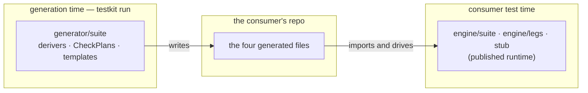
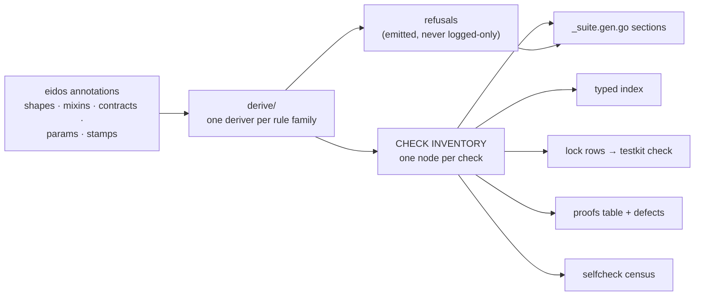

# Suite plugin — target architecture

The Phase 2 design: `generator/suite` rewritten in place to emit the
four-file gen shape. No code here — structure, contracts, and the
proofs that the structure can carry the whole corpus. Sequencing lives
in the roadmap; system invariants in `generator-architecture.md`.

## What runs where (read this first)

Every Go file in this plan is BUILD-TIME machinery: it executes inside
`testkit run`, computes a description of what should exist, renders it,
and is gone. Nothing under `generator/` reaches a consumer's module
graph, build, or test run.



The projection's `CheckPlan` node and the runtime's `suite.Check` are
deliberately different types with different lifetimes: the plan is the
emitter's blueprint, alive for milliseconds; the generated file
constructs `suite.Check` values — the building — at the consumer's
test time. The plugin's Go volume is the price of DUMB templates:
derivation logic lives in Go, where lint, types, coverage and race
gates see it, instead of in template text where nothing does.

## The one idea everything hangs on

**A single check inventory is the source of every artifact.** The
audits' deepest finding was claims drifting from assertions because
claim text, probe sets, lock rows, and proofs were four hand-kept
spellings of one fact. The emitter closes that class structurally: one
`CheckPlan` node per derived check, and every artifact is a projection of
the inventory — the file body, the typed index, the lock rows, the
proofs table, the selfcheck census, the coverage refusals. A claim
cannot be wider than its probe set when both render from the same node.



## Layers (SOLID mapping)

| Layer | Owns | Changes when |
|---|---|---|
| `projection/` | the data model: CheckPlan nodes, harness/veneer/fixture shapes, the inventory and its projections | the emitted CONTRACT changes (a new artifact, a new capability) |
| `derive*.go` + `claims.go` (flat in the plugin package) | annotation → inventory: family derivers driven by STAMP-RULES TABLES keyed on the upstream packages' own `Name` constants, operating on the incumbent `Method`/`Fixture` projections — tiers identifies the law-backed set, and anything else refuses with the census framing | a derivation RULE changes (`derivation-rules.md` is the spec) |
| `templates/` | inventory → Go text: structural templates plus one template per BODY SHAPE | the SPELLING changes |
| `suite.go` + `suite_go.go` | plugin declaration, Generate skeleton, outputs, registry wiring | the platform contract changes |

Single responsibility per layer; open for extension through the
registries (derivers, stamp rules, body shapes) whose totality a
conformance-gate census enforces — the tiers/lawRoleShapes pattern,
reused. The census is the answer to a registry of any size: every
upstream classification is either tabled here, law-backed in tiers, or
a NAMED refusal — three-way partition, held equal to the registry by
the gate, so an uncovered shape is a build failure with a name and
never silence. ARMED: the gate iterates `mixins.All()`,
`detectors.All()` and `contracts.All()` and holds every name to a
placement, both directions (an eidos addition fails by name; a
recorded entry a row or law now covers fails as stale). PENDING
entries name their owning batch and must be empty by the flip. No hand enumeration of the vocabulary exists in the
derive layer. Templates
depend only on projection structs (dependency inversion); the model
plugin and `testkit check` read a small exported façade of the
projection, never the derive internals (interface segregation — the
incumbent's `*suite.Contract` habit, formalized).

## The CheckPlan node (the contract's heart)

One node, closed variants where families differ — deliberately NOT an
open bag of optional fields (the god-struct is this design's known
failure mode; the variant census is its guard):

```yaml
# The populated sample: scantest's Append smoke, as derived.
checkplan:
  id:          {method: Append, seg: smoke}        # renders "Append/smoke"
  class:       signature/smoke
  claim:       "Append survives a call with a derived entry"
  needs:       {}                                  # no capability doors
  body:                                            # ONE of the body variants
    kind:      smoke-survives
    call:      {method: Append, args: [ctx, fixture.entry]}
  falsifiable: proven
  defect:                                          # ONE of the defect variants
    kind:      stub-panic                          # the W-family rule
    via:       {option: WithLogAppend, shape: panic}
  binds:       []                                  # law-binding checks carry law IDs + probe sets

# Its projections, recomputable by a skeptic:
index:  LogSuite.Checks.Append.Smoke()  ->  "Append/smoke"
lock:   "Append/smoke\tsignature/smoke\tAppend survives a call with a derived entry\t"
proofs: ix.Append.Smoke(): one("a log whose every method panics", ...)
```

Body variants (the closed set, one template each): `smoke-survives`,
`cancel-call`, `deadline-call`, `nilctx-call`, `zero-on-error`,
`mixin-probe`, `law-leg` (delegates to legs; carries law IDs + probe
sets that also render into `binds`), `differential-leg`, `sim-leg`,
`row-sugar` (consumer extension seam), `produced-secondary-smoke`.
Budget: ~12–15 body templates plus ~10 structural templates (veneer,
index, harness, entries, rows, fixture, selfcheck, proofs, defect
constructors, package prose) — against the incumbent's 55. A new body
shape is a design event, not a workaround; the census makes an
unregistered one a build failure.

Defect variants mirror the proofs rules (`derivation-rules.md`):
stub-panic, ctx-swap, discard-write, freeze-return, fresh-medium,
sentinel-once, partial-outlive, accepts-nil, exceed-bound — each a
small template over the generated double, plus `argued(reason)` for
families with no rule (never an underived Proven).

## Folder and file structure

```
generator/suite/
├── doc.go                    # plugin doctrine: inventory-first, refusals emitted
├── suite.go                  # sdk declaration, Generate skeleton, diagnostics
├── suite_go.go               # outputs (the two-file pair), template embed, funcmap
├── facade.go                 # the exported read surface: Inventory, Harness
│                             #   (what model and testkit check consume)
├── lockrows.go               # inventory → engine/suite lock rows; the seam
│                             #   `testkit check` renders/verifies checks.lock from
├── derive.go                 # Iface input, deriver registry, Refusal   [BUILT]
├── derive_signature.go       # smoke/cancel/deadline/nilctx/zero       [BUILT]
├── derive_stamps.go          # mixin + detector rules tables, census   [BUILT]
├── derive_contracts.go       # contract arm: opener + borrow smokes
│                             #   [BUILT]; direct contract checks
│                             #   (if-absent, if-match, outbox) pending
├── derive_pools.go           # roled defaults → PoolPlans; refusals  [BUILT]
│                             #   (type-level roles land with bus/cache)
├── derive_caps.go            # capability doors per class            [BUILT]
│                             #   (recover joins with the sim license)
├── derive_proofs.go          # mechanical defect rules; residue      [BUILT]
│                             #   Argued; F1 gated on StripRoleField
├── claims.go                 # the claim wording policy, corpus-pinned [BUILT]
├── projection/
│   ├── check.go              # CheckPlan node + body/defect variant types + census
│   ├── inventory.go          # per-interface inventory; censuses
│   ├── index.go              # the typed check index a Without names [BUILT]
│                             #   groups by ID scope, not by deriver; method
│                             #   accessors from the segment, family ones
│                             #   from lawid (accessor + const, one home)
│   ├── harness.go            # A10 structurally: doors → fields      [BUILT]
│   └── fixture.go            # PoolPlan + the member transforms      [BUILT]
│                             #   (pool[1] test→other, pool[2] hostile;
│                             #   refusal where a splice would lie)
└── templates/golang/         # one tree, because there is one emitter
    │                         #   now. The eidos backend recursively parses
    │                         #   every .tmpl in the plugin's FS with one
    │                         #   merged function map, so a second tree
    │                         #   would only have bought separation from an
    │                         #   incumbent parse that no longer exists.
    ├── suite.contract.tmpl   # structural: the file and its banner
    ├── suite.index.tmpl      # method-name consts + the typed index [BUILT]
    ├── suite.entry.tmpl      #   [TRANSITIONAL until the rows land]
    ├── suite.options.tmpl    #   see the transition section below
    ├── body/                 # one .tmpl per body variant, each {{define}}
    │                         #   named for the kind that dispatches to it
    │                         #   smoke.tmpl [BUILT: three arms, one claim]
    └── defect/               # one .tmpl per defect variant
```

The render seam: a body's kind IS its template's {{define}} name, so
an unregistered variant fails by name; the census holds defined
templates to registered variants one-way until the set completes,
then flips to equality. The view carries what no projection does —
the receiver ident, the check-name constant, the discard arity —
because those are the METHOD's facts, resolved when the emitter
walks the inventory beside the methods.

THE FOLD (executed): the derive layer is flat files in the plugin
package, not a `derive/` subpackage. The subpackage boundary forced a
parallel facts model (`MethodFacts` beside the incumbent's `Method`) —
a third copy of reality after eidos's bags and the incumbent
projection, and every copy is a chance to disagree about what the run
classified. The rules now read `Method` directly (`TakesContext`,
`Shape`, `MixinParam`, `ArgFields`, `ValueReturns`, `teardownShaped`),
refuse through `Fixture`'s own undeliverability facts, and key their
tables on the eidos packages' `Name` constants. The incumbent's pool
derivation (`fixture.go`) already lives in this package — the planned
`derive/fixture.go` port dissolves into reusing it.

## The wording frontier (named gaps, not silent resolutions)

Rekeying the claims onto real stamps surfaced four wordings the corpus
pins but no licensed input yet derives. Each is a directive-design or
corpus-amendment decision owed before the flip can reproduce the locks:

- **`idempotent=false` cannot stamp.** eidos's mixin directive requires
  a positional name and denies negation, so the declared-not-idempotent
  form parses to nothing — the accumulates family (`Incr/accumulates`)
  is underivable until an upstream grammar ruling (a value-form boolean
  or an idempotent param). `AccumulatesClaim` keeps the wording ready.
- **Lookup's miss sentinel has no home.** The catalog fixture declares
  `ErrNotFound` in prose only, and prose licenses nothing; the one
  stamped sentinel home today is the ttl declaration's `notfound`
  param (kv Get). The reader detector needs a sentinel seat, or the
  fixture a stamp, before `Lookup/miss` derives its corpus spelling.
- **The "counted" verb is domain wording.** The derived defaults are
  supply-shaped — "wrote"/"written" for writer-fed, "seeded" for the
  seed seam — and `Total reports zero for a key nothing has counted`
  is reachable only through a directive param or a corpus
  reconciliation onto the derived form.
- **Composite-request smokes.** `Put survives a call with derived
  inputs` for a one-struct draw needs the fixture's composed-field
  fact; the claim policy gains that input when the emitter wires real
  projections. The type-noun rule is already corpus-true for the
  scalar draws (`Lookup(ctx, id Key)` words "a seeded key").

Also on the frontier: **context families on a borrowed-input method.**
The borrow arm derives the smoke alone; a borrowed method under the
ctx directive would need its cancel/deadline/nilcontext calls to
borrow too, and no corpus contract declares both. The rule waits for
an instance rather than guessing one.

## Amendment: the proof rules — BUILT; F1 needs a variant (PROPOSED)

The planted-defect rules are tables the row constructors consult, per
the corpus's own defect-emitter audit: W1 discard-write (the writer's
stub option) proves every agreement row — differential, linearizable,
bundle; P1 sentinel-once (the stamped sentinel, the same declaration
that licensed the law) proves poison; the after-close outliving
method (PartialOutlive on a stamped carrier's option) proves the
lifecycle law; R1 freeze-return proves the appender. The residue —
cursor hand types, lease accounting — has no rule and stays Argued
with the pending reason, never an underived Proven.

PROPOSED contract delta: F1 strip-role-field (zero the field the
mixin names — the ttl proof's immortal store) has no defect variant
in the closed set. Proposal: `StripRoleField{Field string}` joins the
defect variants (14th), its template zeroing the named field on the
double's write path. Until ratified, ttl rows ship Argued and the
flip-parity test pins that.

## Amendment: the differential row — BUILT; the sim family — BLOCKED ON A LICENSE

The differential deriver plans the reference-comparison row from the
oracle facts tiers already owns: `DefeatsOracles` refuses (the twin
floor's wording has no corpus pin), the cursor contract drains
(writer-opener named sequence), a contract with a store row agrees —
on every outcome where the oracle speaks error semantics, which is
also what selects the role-pair sequence noun (lease) over
"operation" (chain) — a writer beside a modelled read agrees plainly,
and a seeded read-only surface agrees with a reference seeded
identically. Pool rides an interim store row (outcome semantics) the
tiers catalogue gains with the model plugin's migration, beside the
poison extra-rule. Reconciliation recorded: the store row's "the
subject" wavering resolves to the token, which every other row
already speaks. Frontier: pool's "borrow-return" sequence noun is
domain wording the roles cannot derive; the counter differential's
suppression (an accumulating writer defeats the put-modelled oracle)
rides the `idempotent=false` upstream ruling — until it stamps, a
counter-shaped fixture derives a row the corpus lacks.

**The sim family cannot derive today.** kv's three sim rows are the
only ones in the packs; bus carries a full teardown and has none, so
no classification, contract, or signature fact licenses the family —
the corpus authored it against a durable subject (FileStore) the
generator cannot see. A licensing directive is owed upstream in the
grammar (proposal: `//testkit:sim` on the interface, beside model;
the runtime Excuse seam stays the memory-only escape). The deriver
lands with that ruling.

## Amendment: law claims in lawid, legs in tiers — RATIFIED, BUILT

A law's claim sentence is published surface both modules speak — the
engine reports outcomes, the generator writes locks — so it lives
beside the identifier: `lawid.Claim` is a parametric template over a
closed, censused placeholder vocabulary ({close}, {next}, {produced},
{subject}), `ClaimOf` answers false for the unworded (the deriver's
refusal signal), and `Fill` refuses a half-filled sentence. Leg shape
and class are tier facts: `tiers.LegOf` derives the clocked family
from the bindings' own Timeaware fact and tables the remaining
own-leg laws, bundle by default — total over any registry. The suite
package keeps only leg-level wording (bundle, linearizable) and the
generic fill resolution: no law names its fills, the stamps do. The
selection composition (`Method.Classifications`, `LawParams`) has one
exported home the model generator now reads too — its private copies
are deleted.

The laws deriver's extra-rules table carries the one derivation the
classification axes cannot see (a stamped after-close sentinel
licenses the poison law); its tiers home waits on the model plugin's
migration, because a catalogue row would change the incumbent's
emission today. Law rows ship Argued until the proofs deriver lands
their planted-defect rules. The pool bundle's domain wording ("the
accounting stays internally consistent...") joins the wording
frontier beside "counted".

## Amendment: the borrowed-input smoke (SmokeSurvives.Borrow) — RATIFIED, BUILT

The pool corpus's `Put survives returning a borrowed resource` needs a
prologue no approved variant carries: borrow from the producing
sibling, guard the failed borrow, feed the borrowed value to the
smoked call. Proposal: `SmokeSurvives` grows one field —

```go
type SmokeSurvives struct {
    Call CallPlan
    // Borrow is the producing sibling called first when the
    // smoked method's input is pool-produced: its result feeds
    // the smoked call, and a failed borrow returns without
    // judgment — the producer's own smoke owns that path.
    Borrow CallPlan
    CloseProduced string
}
```

plus `ExprBorrowed` beside `ExprCtx` in the naming policy: the local
the template binds the borrow's result to, referenced by the smoked
call's args. Derivation: a method filling the pool contract's `put`
role is borrow-smoked, the borrow being the `get`-role sibling; the
claim is the corpus spelling, worded in claims.go.

Against my own proposal: one variant now carries three smoke shapes
(plain, opener, borrower), where a variant purist would mint three.
Taken anyway because all three state one claim family — the method
survives an honest call — differing only in prologue/epilogue; three
variants would spend the ≤15 budget on spelling, and a method that
one day both opens and borrows composes for free in the single
variant where split variants would collide on the smoke's one ID.

What is deliberately absent: a `falsify.go` — the incumbent's
falsification companion is superseded by the proofs projection (same
purpose, now a projection of the inventory instead of a parallel
mechanism); and any per-check kind constants — kinds are per SECTION
and per body/defect shape.

## The one dependency decision

The plugin needs the runtime's vocabulary — ID grammar, class
constants, lock rendering — and duplicating grammar across modules is
the drift this whole programme exists to kill. Proposal: **the
generator module imports `engine/suite` for vocabulary only**
(depguard: allow `engine/suite`, keep denying `engine/model` and
rapid/porcupine from generator code). One home for IDs and classes;
`testkit check` renders locks with `engine/suite.RenderLock` directly.
ADR-0005's actual rule — build-time deps never leak into runtime
module graphs — is untouched; this is the reverse direction.

## Production-grade: the corpus-satisfaction matrix

The plan is judged against everything both corpora already demand.
Each row must be reproducible by the structure above, or the structure
changes before code exists:

| Demand (where proven) | Carried by |
|---|---|
| multi-interface packages, uniform ID qualification, first-interface prefixes (kv) | inventory computes qualified IDs from the census; prefix policy in projection, one place |
| oracle / hard-mode runs (bus) | harness projection: Oracle/Serial fields + veneer entries |
| config pools, provenance blending, `DistinctPool` policy (kv, bus, cache) | derive/fixture.go — ported incumbent derivation |
| capability lowering: clock, induce, recover, provides (kv, bus) | derive/caps.go + harness projection (`Subject()` export, `Provide` uniform) |
| seeded corpus through the constructor (kv catalog) | fixture projection's seed seam |
| produced-secondary surface: opener smoke closes what it opens, no smokes for the produced type (scan) | contracts deriver, produced-secondary body variant |
| claim width = probe set (remediation B1) | structural: one node renders claim, probes, binds |
| lock v2 with binds; `TESTKIT_LOCK_WRITE` workflow | lockrows.go + engine/suite rendering |
| proofs parity both directions; partial-outlive, accepts-nil defects | proofs projection; defect variants |
| negative-control seam: scaffold slot + missing-control report note (ownership split) | selfcheck projection emits the note; scaffold slot is a `testkit scaffold` duty, referenced not built |
| `Prove*` variadic, `TrySuite`, `DeclaredLimit`, witnesses, seed-truth banner, banner/package blank line | structural templates; the consolidation's recorded rules |
| every incumbent coverage warn (declined, unchecked, undeliverable input, unseeded) | derive refusals — same families, now also named in the emitted header |
| conformance fixtures with no gen-pack precedent (saga, tx, pagination, singleflight, …) | signature/contract derivers must classify them or refuse loudly; the gate's fixture-per-classification census is the proof |

The last row is the honest frontier: the gen packs prove five domains;
the conformance corpus's thirty-odd contracts are where the derivers
earn generality. The census — every classification has a fixture,
every fixture emits or carries a named refusal — is the measurement.

## Migration mechanics (the in-place cost, stated)

A plugin emits one shape, so the flip is one large commit: template
rewrite + version bump + 673 outputs regenerated + the corpus
fixtures' hand-written consumer tests adapted to the new API. The gen
packs are the preparation that makes this survivable — every consumer
recipe (harness literals, rows, controls, proofs) is already written
five times over there. Sequence inside Phase 2:

1. Build the plugin against `plugintest` goldens (the stub plugin's
   `-update-golden` workflow), scantest-shaped first.
2. Prove the emitted scantest package against gen's own tests
   (delete-and-regen on the testbed — the behavioral gate).
3. The flip commit: regenerate the conformance corpus, adapt its
   hand-written fixture tests with the gen recipes, all gates green.
4. `testkit check` lock verification arms once locks exist corpus-wide.

Model and stub plugins are out of scope here: stub already emits its
target; model follows this plan's shape with `tiers` unchanged.

## Amendment: the context families derive from the shape — RATIFIED

RFC-0004 A13 made context semantics a declared claim behind
`//testkit:ctx`, on the argument that a `(ctx, ...)` parameter claims
nothing about propagation and unconditional checks red correct code on
first contact. That gate is REVERSED: a context-taking method carries
cancel, nilcontext and — where it is not teardown-shaped — deadline,
derived from the parameter, and zero-on-error rides the same shape.

The reversal is a judgment about where the opt-out belongs, not a
denial of A13's failure mode. A subject that legitimately never
observes cancellation still exists; it now declines the check by ID
through `Without`, which is a decision recorded in the consumer's own
code and visible in the lock diff, rather than by withholding a
directive, which is a decision recorded nowhere and indistinguishable
from never having considered it. The directive also cost a second
thing to keep in sync: the claim was declared on the interface while
the shape it gated was per method.

`Iface.CtxDeclared` is deleted rather than defaulted, so nothing reads
a fact that no longer exists.

## Amendment: two qualifiers, because an ID is not an identifier

The corpus found this the hour derivation went live. `Iface.Token`
served as both the Go identifier qualifier and the family-scoped ID's
qualifier, which holds only while interface names are one word — every
validated pack's are. `PaginatedReader` produces the identifier
`paginatedReader` and the ID `model/paginatedReader/laws`, and the ID
grammar admits `a-z`, `0-9` and `-` only, so seven corpus interfaces
refused at `Verify` with the emission never reaching the model tier.

So `Token` stays the Go qualifier and `Qualifier` joins it as the slug
one, projected through `IDQualifier`. Both are computed once in the
shell and carried, rather than recomputed per deriver.

## Amendment: the variant set, corrected against the packs — BUILT

The closed set was named for FAMILIES where the validated bodies differ
by SHAPE, so three names covered thirteen bodies. A one-pass read of
every assert body in the five packs corrected it:

| Was | Is | Why |
|---|---|---|
| `ZeroOnError` | `ZeroOnMiss`, `ZeroOnCancel` | the error is induced two ways, and each is a different statement sequence |
| `MixinProbe` | `RepeatProbe`, `MissProbe`, `HitProbe`, `CountProbe` | one name over four bodies; the repeat's two calls are a precondition and a claim, not a list |
| `ProducedSecondarySmoke` | deleted | no instance in any pack, no construction site, duplicated `SmokeSurvives{CloseProduced}` |

`LawLeg` and `DifferentialLeg` stay as plans and will never have body
templates here: the packs put the model family's INDEX in the suite
file — `logModelIndex` is declared in `scan_suite.gen.go` and appears
nowhere in `scan_model.gen.go` — because the index is per package and
`All()` must reach every ID. The bodies are the model tier's.

The rule that decides between the two zero forms is not the one that
looks right. Not "does the method take an input": the bus's Subscribe
takes a topic, declares no miss, and answers normally for an
unsubscribed one, so a check drawing a miss would skip every run. It is
whether a miss is DECLARED — the `notfound=` sentinel — because only
then does an unwritten input produce anything to inspect.

Still owed on the probes: `HitProbe` and `CountProbe` read back what a
run seeded, and the packs pass the seeded corpus in as a parameter
(`docs map[kv.Key]kv.Value`) that no projection models. That parameter
is the next thing to design, and it is the same question the fixture's
three competing models raise.

## Amendment: ZeroOnError needs three fields it does not have — SUPERSEDED

Superseded by the variant-set correction above, which split the variant
rather than growing it. Kept because the reasoning is what found the
split.

Found rendering it. The variant is `ZeroOnError{Call CallPlan}`, and
the deriver fills Call from `callOf` — the standard draw. The validated
shape needs more than that:

```go
got, err := s.Get(tb.Context(), fx.KeyOther())   // the OTHER draw
if err == nil {
    tb.Skipf("Get answered for %q, so this check has no error to inspect; "+
        "seed a miss through StoreConfig.KeyPool", fx.KeyOther())
}
var zero kv.Value                                 // the RESULT TYPE
if got != zero { ... }
```

Three facts the variant does not carry. The call must draw the miss
member rather than the hit one, or the error the check exists to
inspect never happens. The body declares a zero of each value return,
so it needs those types as renderable references — the emitter cannot
spell a type, only the backend can. And the skip names the pool a
consumer would seed to close the gap, which is a config path.

This is the variant growing fields the day a template renders it, which
is the rule this document already sets — recorded because it is the
first variant whose derivation, not just its spelling, was incomplete,
and because "the call" turning out to mean two different calls is the
kind of thing the other unrendered variants may also be hiding.

The three context arms had no such gap: they are one line over an
engine primitive and the standard call is the right one.

## Amendment: generics, solved rather than gated — BUILT

No validated pack is generic, so the shape had to come from the corpus
rather than from a target. Three facts settled it.

The alias the packs carry — `type Log = scan.Log` — takes parameters:
Go has admitted generic type aliases since 1.24, so
`type Store[K comparable, V any] = generic.Store[K, V]` stands, and
every declaration below it names `Store` with its arguments exactly as
a concrete file names the bare alias.

The harness declares the subject's parameters ahead of its own, because
`T` is constrained by the interface and Go admits no forward reference:
`StoreHarness[K comparable, V any, T Store[K, V]]`. The list itself is
the backend's to render — only it spells a constraint — so the template
composes onto what `renderTypeParams` produced rather than rebuilding
it.

`Without` moves off the veneer for a generic subject. A method cannot
introduce type parameters and a generic interface has no one
instantiation to fix them at, so the veneer keeps only the index — which
is not generic, an ID being a string — and dropping goes through the
package-level `storeWithout[K, V](ids...)`. That is a Go constraint
rather than a preference, and it is the one place a generic subject's
surface reads differently from a concrete one.

## The gap register

Everything open, what blocks it, and who owns it. Written down because
four of these lived only in a conversation, which is the same as not
existing.

### Blocked on a design decision

**The seeded corpus, traced end to end.** `HitProbe` and `CountProbe`
read back what a run seeded, and the packs pass it in —
`catalogAssertLookupHit(tb, c, docs map[kv.Key]kv.Value)` — ranging it
for the hit and taking `len(docs)` for the count. Following it back
shows the chain rather than one missing parameter:

`catalogCorpus()` zips `cfg.KeyPool` against `cfg.ValuePool`, so the
corpus needs the emitted POOL CONFIG — which is what `poolsOf` derives
and nothing consumes, the largest single orphan in the plugin. A seeded
interface also takes a different harness: `Seed func(docs) T` and
`StartSeed` in place of `New`/`Start`, because a reader-only subject
cannot be populated through the surface under test, and `Subject(docs)`
carries it through. `catalogMissKey()` is the key deliberately outside
the corpus, which the miss body draws instead of the fixture's
alternate.

So the batch is: pool config → corpus builder → seeded harness variant
→ the two bodies. The pool config is BUILT: `poolsOf` runs in the shell,
its refusals join the header's, and `<Iface>Config` with
`<token>DefaultConfig()` emits the roled pools with the member type each
declares a slice of.

**It emits nowhere, and that is a corpus gap rather than a plugin one.**
`//testkit:role` is stamped in the gen packs and in NO conformance
fixture, so every corpus interface derives an empty pool set — which is
why `poolsOf` read as an orphan. The section is guarded on having pools
rather than emitting an empty struct, and the derivation stays
unexercised by the gate until a fixture stamps a role. `poolsOf` also
reaches only roles on REQUEST-STRUCT FIELDS; the bare-parameter form,
where the stamp lives on the named type declaration, is not handled and
is what a corpus fixture would most likely exercise first.

**Three fixture models, and the packs implement a fourth.** This
plugin has `FixtureField{Sample, Other, Companion, Parts}` and
`projection.PoolPlan{Role, Field, Members}`; the packs emit
`<token>NewFixture(cfg)` with accessor METHODS — `fx.Key()`,
`fx.KeyOther()`, `fx.Keys()` — plus provenance flags and a request
builder. Every body draws through those accessors, so this decides how
every body reads and wants settling before the bodies are final rather
than after.

**RowSugar is an empty struct standing for the consumer seam.** The
packs' `bind` carries up to five bodies including per-method
`Prop<Method>` fields with pooled-draw plumbing, `NewNameSet` over the
method set, `RowID`/`HandRowID`, `OneBody` and `Falsify`. None of it is
modeled. It is the largest single unbuilt structural piece.

### The index/model seam, moved by the index fix — OWED AT RELINK

The recorded design: an index is PER PACKAGE, so the suite file carries
the model family's index entries and the model file carries its bodies.
The packs confirm it — `logModelIndex` sits in `scan_suite.gen.go` and
is absent from `scan_model.gen.go` — and it is why the suite generator
derives `LawLeg` and `DifferentialLeg` plans it never bodies.

The selfcheck then caught `IndexOf` naming checks the run does not
emit: with the model tier dormant, `Suite.Checks.Model.Laws()` compiled
and dropped nothing, which is the silent drop the typed index exists to
prevent. The fix builds the index from the EMITTED set, and the Model
group is now absent from all 126 generated files.

Right today, wrong at relink. What the packs actually do is compose:

    Checks: append(cacheSignatureChecks(fx), cacheModelChecks(fx)...)

The assembler returns BOTH tiers and the index covers what the
assembler returns — not what this generator emits. So the relink owes
three edits, not one: `<token>Suite` appends the model tier's checks,
`IndexOf` reads the composed set, and the selfcheck's `VerifyIndex`
compares against it. Written down because the seam moved under a bug
fix rather than by decision, and the emitted files no longer show what
the design says.

### The consumer doors deleted with the model options — OWED AT RELINK

The sweep deleted every `<I>Model(...)` call, because the tier is
unregistered and the option no longer exists. Most were bare. Fifteen
carried a door: a closure stating something about the domain that no
derivation invents, and which the relink has to get back. They are
listed here because a deleted closure leaves no trace in the code, and
"the model tier returns" is not enough to reconstruct them.

| Fixture | Door | What it said |
|---|---|---|
| `mixin/eventually` | `ModelMerge` | the lattice join is set union, spelled sorted |
| `mixin/causal` | `ModelHappensBefore` | causal order is revision order within one key |
| `mixin/stableorder` | `ModelLess` | the stated order is key-ascending |
| `mixin/validates` | `ModelValues` | the accepted domain is wider than the derived pair; keys stay few so draws collide |
| `mixin/ttl`, `scheduled`, `timeout`, `windowed` | `ModelClocked` | build the subject on the run's test clock |
| `contract/lease` | `ModelFree` | freeness is probed by acquiring and releasing |
| `contract/pool` | `ModelStats` | the accounting identity, read through the stats role |
| `composite/causal-chain` | `ModelEntryID`, `ModelDependsOn` | the entry's identifier and its edges |
| `lang/generic`, `detector/reader`, and the rest | — | bare `Model()`, nothing to restore |

Two tests went with the tier rather than with an option, and are owed
back the same way: `deleteremoves`'s `TestMixedPropertyCatchesAWrongMissIdentity`
and `tx`'s `TestTwoPhaseCompositeCatchesARefusedOwnHandle`. Both drive
`<I>ModelProperty` against a planted defect and assert the rejection
message, which is the saturation posture the model tier owns.

### Blocked on a ruling or on upstream

- **The accumulates claim has no positive name.** [AccumulatesClaim]
  is worded and corpus-pinned, and nothing can license it. The earlier
  note here proposed `//-testkit:mixin idempotent` and called the
  negated form "the right spelling"; that contradicts ADR-0016, which
  rules the negated form out of the vocabulary for the reason that
  settles it — a mixin appears only because someone wrote the
  directive, so deleting it IS the suppression, and there is nothing
  to switch off. `DenyNegation` on the mixin schema is the substrate
  agreeing. What the claim actually needs is a mixin of its own,
  registered upstream under a positive name, if the claim is worth
  checking at all.

- **There is no sim tier yet.** `SimLeg` is a variant with no bodies
  because the tier it belongs to is unbuilt, not because a directive
  blocks it. Nothing here waits on it.

### Divergences from the packs, chosen and reversible

Each is a place the packs disagree with themselves or with a rule this
tree holds elsewhere, so a generator had to pick one spelling.

| Here | Packs | Why |
|---|---|---|
| `<token>PutRequest()` | `fx.Put()` | one instance, no second to infer a rule from; ours is the type name, which every other draw follows |
| `Miss` | `ReportsAMiss` and `Miss` | the mechanical segment rule, which reaches segments the packs never exercised |
| `suite.Survives` everywhere | Counter asserts success directly | already what this generator emits; kv's Journal is the same situation and agrees, so Counter's dialect is the pack's own variation |
| `produced`, `borrowed` | `cur`, `c` | the naming policy's one home, against two ad-hoc locals |

### Deferred with an owner, deliberately evidence-first

- **~800 production lines derive artefacts no template consumes** —
  `poolsOf`, `HarnessOf` and `LockLines` have no production caller.
  This is the derive layer built ahead of its emission. The bodies will
  prove which projections are real; anything still unconsumed then is a
  deletion list written from evidence rather than guessed at now. The
  defect layer just came off this list: `projection/defect.go` and
  `derive_proofs.go` were the second-largest orphan and are now the
  companion's whole input, which is evidence for waiting rather than
  deleting.
- **The single-responsibility splits** — `suite.go` carries seven jobs,
  `fixture.go` five, and `derive_laws.go` hides the cross-plugin stamp
  API `generator/model` imports. Each is a move, and each wants doing
  when the file is not also being rewritten by the emission arc.

### Transitional, and dated

- Three evidence-census tests skip, carrying `expires 2026-09-18`, so
  the skip-expiry gate holds the deferral rather than anyone's memory.
- ~~The corpus's generated companions are orphans referencing `Assert*`
  symbols nothing emits yet — 126 undefined references, which clear
  when the rows land.~~ **Wrong, and closed.** They did not clear when
  the rows landed and could not have: the incumbent's companions called
  the exported `Assert<Iface><Method><Seg>`, while the rewrite emits the
  packs' unexported `<token>Assert<Method><Word>`, and nothing had
  regenerated the companion since the sweep deleted its template. What
  closed it was emitting the companion the plugin's second output has
  declared all along — see the proofs section below. The corpus's
  generated files now vet clean; what is left is 122 references in
  HAND-WRITTEN `inmemory_test.go` fixtures to `<Iface>WithoutDouble` and
  the incumbent's assert names, which is corpus work and not the
  plugin's.
- ~~**This plugin has no pipeline-level test.**~~ **Closed.**
  `generator/suite/suite_test.go` renders the harness, its companion and
  the double into a throwaway module, then builds, vets and RUNS it. The
  last of those is the one that matters: `prove.All` fails a claim with
  no evidence, evidence naming no claim, and a defect the check
  tolerated, so the emitted claims and the emitted proofs are held to
  each other by the plugin's own test rather than by a corpus regen
  somebody has to remember.

### The proofs companion — BUILT

The `_test.go` output has been declared since the rewrite began and
written by nothing. It now carries what `derive_proofs.go` and
`projection/defect.go` have derived all along: one planted defect per
check the run stamps Proven, driven through that check by `prove.All`.

Four of the thirteen defect variants render — `stub-panic`, `ctx-swap`,
`accepts-nil`, `second-call-errs`. The rest need a NON-ZERO value of a
result type (`echo-beside-error` must answer a live value beside its
error; `invents-hit` without a declared sentinel must answer where
nothing was written), and inventing one is the fixture's sample
machinery, not yet wired to a return slot. Two decisions fell out of
building it:

- **A row's stamp follows its evidence, not its deriver.** A plan
  stamped Proven whose defect variant no template spells is emitted
  `ArguedCheck` with the reason "no defect template spells X yet". The
  alternative — emit Proven and let `prove.All` fail — reports a
  generator gap against the generated file. `suite.ArguedCheck` is new
  beside `ProvenCheck` for this.
- **A proof quotes its red by CONSTANT.** `suite.RedPanicked` and its
  three siblings are declared where the primitive's message is written,
  the message is built from them, and `RedConst(seg)` is what the
  generator emits. Quoting the text would let a reworded primitive
  silently weaken every proof reading it; naming the constant makes the
  same reword a compile error. Segments whose failure prose is authored
  in a BODY template — the repeat and miss probes — have no constant to
  quote and get no `Reasoned`, which is a weaker proof and is said out
  loud in the generated comment.

The value-free trick worth remembering: a defect that must ANSWER uses
a bare `return` under named results, so every slot yields its own zero
without the generator naming a type it may not be able to spell.

Two consequences elsewhere. `<token>Suite(fx) suite.Suite[T]` and the
veneer's `Suite` accessor exist because the companion is an EXTERNAL
test package and the assembler is unexported — eidos's layout shifts
every `_test.go` into `<pkg>_test` unconditionally, so an internal
companion (which is what the packs are) is not reachable from here. A
generic subject gets a note instead of proofs, because a Go test
function takes no type parameters.

## The transition: what the sweep unowned, and what buys it back

The clean sweep deleted the incumbent emission before the rewrite's
emission exists, so the tree spends the interval with three named
holes. They are written down here because the alternative — a gate
relaxed until it passes — is a hole nobody finds again.

**1. Three structural templates are transitional.** The index emits
(`suite.index.tmpl`), and the rows and their assertion bodies are what
remains.
`suite.contract.tmpl`, `suite.entry.tmpl` and `suite.options.tmpl`
still render, and render clean: every reference to a deleted field
(`CheckCount`, `Checks`, `Double`, `Unwritten`, `Elsewhere`,
`Unfalsifiable`) is cut, with `{{/* transition */}}` marking where the
generated invocations go. What they emit today is the shell — options,
subjects, the per-method `t.Run` tree, the consumer extension seam —
with no generated checks inside it. Closed by: the emission arc's root
node and body templates.

**2. The evidence census measures nothing on the suite axis.**
`evidenceFrom` read `Contract.Coverage`, and both halves came from
there: `Checked` from `Asserted()`, `Modeled` from `Elsewhere()`.
Nothing was substituted for either. Rebuilding one half from elsewhere
— the model tier's live `Bindings`, say — would be a second derivation
of a question the generator itself answers, which is the disagreement
`Evidenced`'s own docblock exists to prevent. So the maps stay empty
and three tests skip rather than pass vacuously:
`TestEveryClassificationHasEvidenceOrARow`,
`TestNoUnevidencedRowIsStale`, `TestEvidencedRowsNameTheirFixture`.
The two that still run are the two that still mean something — the
registry-total row count, and the failed-run arm that keeps an empty
census from reading as full coverage. Closed by: rebuilding the census
off the deriver inventory, which is a better source than the walk it
replaces, because it knows per interface which classification each
plan came from *and* reports its refusals by name.

**3. The generated corpus is stale against the new plugin.** Nothing
regenerates until the emission lands; step 3 of the migration
mechanics above is unchanged.

The skips are deferred work with an owner, not a resting state. The
owner is the emission arc, and the day it lands each of the three is
restored here or argued here — not left quietly green. They carry
`expires 2026-09-18` so the deferral is held by the skip-expiry gate
rather than by anyone's memory: past that date the build reddens on
them until the census is rebuilt or the date is argued forward here.

## Risks, argued against myself

- **The CheckPlan node becomes a god-struct.** Guard: body and defect are
  closed variant sets with a census; a family that wants "one more
  optional field" instead adds a variant and a template, visibly.
- **Body shapes multiply back toward 55.** Guard: the budget is in
  this document; exceeding ~15 is a design review, and the counting is
  a gate, not a habit.
- **The big-flip commit.** Genuinely large; mitigated by goldens and
  the gen-pack recipes, not avoidable under no-versioning. The drift
  gate makes a half-done flip impossible to merge silently.
- **Generality debt surfaces late.** Guard: the deriver census runs
  against ALL fixtures from day one — refusals are legal, silence is
  not, so the frontier is enumerated before the flip, not after.
