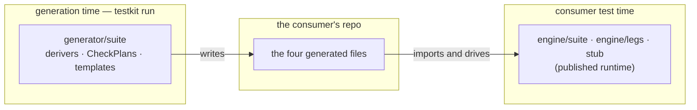
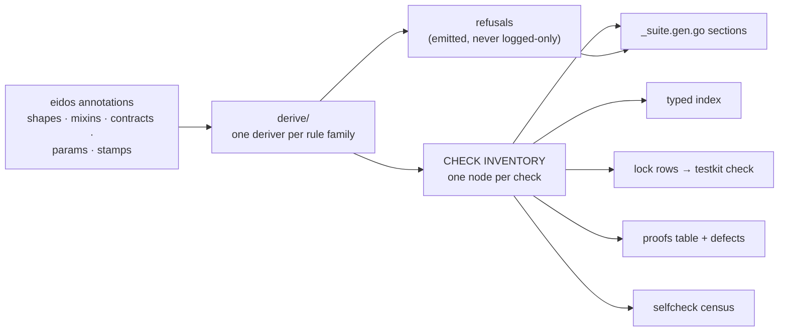

# Suite plugin — target architecture

The Phase 2 design: `generator/suite` rewritten in place to emit the
four-file gen shape. No code here — structure, contracts, and the
proofs that the structure can carry the whole corpus. Sequencing lives
in the roadmap; system invariants in `generator-architecture.md`.

## What runs where (read this first)

Every Go file in this plan is BUILD-TIME machinery: it executes inside
`testkit run`, computes a description of what should exist, renders it,
and is gone. Nothing under `generator/` reaches a consumer's module
graph, build, or test run.



The projection's `CheckPlan` node and the runtime's `suite.Check` are
deliberately different types with different lifetimes: the plan is the
emitter's blueprint, alive for milliseconds; the generated file
constructs `suite.Check` values — the building — at the consumer's
test time. The plugin's Go volume is the price of DUMB templates:
derivation logic lives in Go, where lint, types, coverage and race
gates see it, instead of in template text where nothing does.

## The one idea everything hangs on

**A single check inventory is the source of every artifact.** The
audits' deepest finding was claims drifting from assertions because
claim text, probe sets, lock rows, and proofs were four hand-kept
spellings of one fact. The emitter closes that class structurally: one
`CheckPlan` node per derived check, and every artifact is a projection of
the inventory — the file body, the typed index, the lock rows, the
proofs table, the selfcheck census, the coverage refusals. A claim
cannot be wider than its probe set when both render from the same node.



## Layers (SOLID mapping)

| Layer | Owns | Changes when |
|---|---|---|
| `projection/` | the data model: CheckPlan nodes, harness/veneer/fixture shapes, the inventory and its projections | the emitted CONTRACT changes (a new artifact, a new capability) |
| `derive*.go` + `claims.go` (flat in the plugin package) | annotation → inventory: family derivers driven by STAMP-RULES TABLES keyed on the upstream packages' own `Name` constants, operating on the incumbent `Method`/`Fixture` projections — tiers identifies the law-backed set, and anything else refuses with the census framing | a derivation RULE changes (`derivation-rules.md` is the spec) |
| `templates/` | inventory → Go text: structural templates plus one template per BODY SHAPE | the SPELLING changes |
| `suite.go` + `suite_go.go` | plugin declaration, Generate skeleton, outputs, registry wiring | the platform contract changes |

Single responsibility per layer; open for extension through the
registries (derivers, stamp rules, body shapes) whose totality a
conformance-gate census enforces — the tiers/lawRoleShapes pattern,
reused. The census is the answer to a registry of any size: every
upstream classification is either tabled here, law-backed in tiers, or
a NAMED refusal — three-way partition, held equal to the registry by
the gate, so an uncovered shape is a build failure with a name and
never silence. ARMED: the gate iterates `mixins.All()`,
`detectors.All()` and `contracts.All()` and holds every name to a
placement, both directions (an eidos addition fails by name; a
recorded entry a row or law now covers fails as stale). PENDING
entries name their owning batch and must be empty by the flip. No hand enumeration of the vocabulary exists in the
derive layer. Templates
depend only on projection structs (dependency inversion); the model
plugin and `testkit check` read a small exported façade of the
projection, never the derive internals (interface segregation — the
incumbent's `*suite.Contract` habit, formalized).

## The CheckPlan node (the contract's heart)

One node, closed variants where families differ — deliberately NOT an
open bag of optional fields (the god-struct is this design's known
failure mode; the variant census is its guard):

```yaml
# The populated sample: scantest's Append smoke, as derived.
checkplan:
  id:          {method: Append, seg: smoke}        # renders "Append/smoke"
  class:       signature/smoke
  claim:       "Append survives a call with a derived entry"
  needs:       {}                                  # no capability doors
  body:                                            # ONE of the body variants
    kind:      smoke-survives
    call:      {method: Append, args: [ctx, fixture.entry]}
  falsifiable: proven
  defect:                                          # ONE of the defect variants
    kind:      stub-panic                          # the W-family rule
    via:       {option: WithLogAppend, shape: panic}
  binds:       []                                  # law-binding checks carry law IDs + probe sets

# Its projections, recomputable by a skeptic:
index:  LogSuite.Checks.Append.Smoke()  ->  "Append/smoke"
lock:   "Append/smoke\tsignature/smoke\tAppend survives a call with a derived entry\t"
proofs: ix.Append.Smoke(): one("a log whose every method panics", ...)
```

Body variants (the closed set, one template each): `smoke-survives`,
`cancel-call`, `deadline-call`, `nilctx-call`, `zero-on-error`,
`mixin-probe`, `law-leg` (delegates to legs; carries law IDs + probe
sets that also render into `binds`), `differential-leg`, `sim-leg`,
`row-sugar` (consumer extension seam), `produced-secondary-smoke`.
Budget: ~12–15 body templates plus ~10 structural templates (veneer,
index, harness, entries, rows, fixture, selfcheck, proofs, defect
constructors, package prose) — against the incumbent's 55. A new body
shape is a design event, not a workaround; the census makes an
unregistered one a build failure.

Defect variants mirror the proofs rules (`derivation-rules.md`):
stub-panic, ctx-swap, discard-write, freeze-return, fresh-medium,
sentinel-once, partial-outlive, accepts-nil, exceed-bound — each a
small template over the generated double, plus `argued(reason)` for
families with no rule (never an underived Proven).

## Folder and file structure

```
generator/suite/
├── doc.go                    # plugin doctrine: inventory-first, refusals emitted
├── suite.go                  # sdk declaration, Generate skeleton, diagnostics
├── suite_go.go               # outputs (the two-file pair), template embed, funcmap
├── facade.go                 # the exported read surface: Inventory, Harness
│                             #   (what model and testkit check consume)
├── lockrows.go               # inventory → engine/suite lock rows; the seam
│                             #   `testkit check` renders/verifies checks.lock from
├── derive.go                 # Iface input, deriver registry, Refusal   [BUILT]
├── derive_signature.go       # smoke/cancel/deadline/nilctx/zero       [BUILT]
├── derive_stamps.go          # mixin + detector rules tables, census   [BUILT]
├── derive_contracts.go       # contract arm: opener + borrow smokes
│                             #   [BUILT]; direct contract checks
│                             #   (if-absent, if-match, outbox) pending
├── derive_pools.go           # roled defaults → PoolPlans; refusals  [BUILT]
│                             #   (type-level roles land with bus/cache)
├── derive_caps.go            # capability doors per class            [BUILT]
│                             #   (recover joins with the sim license)
├── derive_proofs.go          # mechanical defect rules; residue      [BUILT]
│                             #   Argued; F1 gated on StripRoleField
├── claims.go                 # the claim wording policy, corpus-pinned [BUILT]
├── projection/
│   ├── check.go              # CheckPlan node + body/defect variant types + census
│   ├── inventory.go          # per-interface inventory; index tree, censuses
│   ├── harness.go            # A10 structurally: doors → fields      [BUILT]
│   └── fixture.go            # PoolPlan + the member transforms      [BUILT]
│                             #   (pool[1] test→other, pool[2] hostile;
│                             #   refusal where a splice would lie)
└── templates/golang/
    ├── file/                 # structural: banner-spacing rule lives here
    ├── body/                 # one .tmpl per body variant
    └── defect/               # one .tmpl per defect variant
```

THE FOLD (executed): the derive layer is flat files in the plugin
package, not a `derive/` subpackage. The subpackage boundary forced a
parallel facts model (`MethodFacts` beside the incumbent's `Method`) —
a third copy of reality after eidos's bags and the incumbent
projection, and every copy is a chance to disagree about what the run
classified. The rules now read `Method` directly (`TakesContext`,
`Shape`, `MixinParam`, `ArgFields`, `ValueReturns`, `teardownShaped`),
refuse through `Fixture`'s own undeliverability facts, and key their
tables on the eidos packages' `Name` constants. The incumbent's pool
derivation (`fixture.go`) already lives in this package — the planned
`derive/fixture.go` port dissolves into reusing it.

## The wording frontier (named gaps, not silent resolutions)

Rekeying the claims onto real stamps surfaced four wordings the corpus
pins but no licensed input yet derives. Each is a directive-design or
corpus-amendment decision owed before the flip can reproduce the locks:

- **`idempotent=false` cannot stamp.** eidos's mixin directive requires
  a positional name and denies negation, so the declared-not-idempotent
  form parses to nothing — the accumulates family (`Incr/accumulates`)
  is underivable until an upstream grammar ruling (a value-form boolean
  or an idempotent param). `AccumulatesClaim` keeps the wording ready.
- **Lookup's miss sentinel has no home.** The catalog fixture declares
  `ErrNotFound` in prose only, and prose licenses nothing; the one
  stamped sentinel home today is the ttl declaration's `notfound`
  param (kv Get). The reader detector needs a sentinel seat, or the
  fixture a stamp, before `Lookup/miss` derives its corpus spelling.
- **The "counted" verb is domain wording.** The derived defaults are
  supply-shaped — "wrote"/"written" for writer-fed, "seeded" for the
  seed seam — and `Total reports zero for a key nothing has counted`
  is reachable only through a directive param or a corpus
  reconciliation onto the derived form.
- **Composite-request smokes.** `Put survives a call with derived
  inputs` for a one-struct draw needs the fixture's composed-field
  fact; the claim policy gains that input when the emitter wires real
  projections. The type-noun rule is already corpus-true for the
  scalar draws (`Lookup(ctx, id Key)` words "a seeded key").

Also on the frontier: **context families on a borrowed-input method.**
The borrow arm derives the smoke alone; a borrowed method under the
ctx directive would need its cancel/deadline/nilcontext calls to
borrow too, and no corpus contract declares both. The rule waits for
an instance rather than guessing one.

## Amendment: the proof rules — BUILT; F1 needs a variant (PROPOSED)

The planted-defect rules are tables the row constructors consult, per
the corpus's own defect-emitter audit: W1 discard-write (the writer's
stub option) proves every agreement row — differential, linearizable,
bundle; P1 sentinel-once (the stamped sentinel, the same declaration
that licensed the law) proves poison; the after-close outliving
method (PartialOutlive on a stamped carrier's option) proves the
lifecycle law; R1 freeze-return proves the appender. The residue —
cursor hand types, lease accounting — has no rule and stays Argued
with the pending reason, never an underived Proven.

PROPOSED contract delta: F1 strip-role-field (zero the field the
mixin names — the ttl proof's immortal store) has no defect variant
in the closed set. Proposal: `StripRoleField{Field string}` joins the
defect variants (14th), its template zeroing the named field on the
double's write path. Until ratified, ttl rows ship Argued and the
flip-parity test pins that.

## Amendment: the differential row — BUILT; the sim family — BLOCKED ON A LICENSE

The differential deriver plans the reference-comparison row from the
oracle facts tiers already owns: `DefeatsOracles` refuses (the twin
floor's wording has no corpus pin), the cursor contract drains
(writer-opener named sequence), a contract with a store row agrees —
on every outcome where the oracle speaks error semantics, which is
also what selects the role-pair sequence noun (lease) over
"operation" (chain) — a writer beside a modelled read agrees plainly,
and a seeded read-only surface agrees with a reference seeded
identically. Pool rides an interim store row (outcome semantics) the
tiers catalogue gains with the model plugin's migration, beside the
poison extra-rule. Reconciliation recorded: the store row's "the
subject" wavering resolves to the token, which every other row
already speaks. Frontier: pool's "borrow-return" sequence noun is
domain wording the roles cannot derive; the counter differential's
suppression (an accumulating writer defeats the put-modelled oracle)
rides the `idempotent=false` upstream ruling — until it stamps, a
counter-shaped fixture derives a row the corpus lacks.

**The sim family cannot derive today.** kv's three sim rows are the
only ones in the packs; bus carries a full teardown and has none, so
no classification, contract, or signature fact licenses the family —
the corpus authored it against a durable subject (FileStore) the
generator cannot see. A licensing directive is owed upstream in the
grammar (proposal: `//testkit:sim` on the interface, beside model;
the runtime Excuse seam stays the memory-only escape). The deriver
lands with that ruling.

## Amendment: law claims in lawid, legs in tiers — RATIFIED, BUILT

A law's claim sentence is published surface both modules speak — the
engine reports outcomes, the generator writes locks — so it lives
beside the identifier: `lawid.Claim` is a parametric template over a
closed, censused placeholder vocabulary ({close}, {next}, {produced},
{subject}), `ClaimOf` answers false for the unworded (the deriver's
refusal signal), and `Fill` refuses a half-filled sentence. Leg shape
and class are tier facts: `tiers.LegOf` derives the clocked family
from the bindings' own Timeaware fact and tables the remaining
own-leg laws, bundle by default — total over any registry. The suite
package keeps only leg-level wording (bundle, linearizable) and the
generic fill resolution: no law names its fills, the stamps do. The
selection composition (`Method.Classifications`, `LawParams`) has one
exported home the model generator now reads too — its private copies
are deleted.

The laws deriver's extra-rules table carries the one derivation the
classification axes cannot see (a stamped after-close sentinel
licenses the poison law); its tiers home waits on the model plugin's
migration, because a catalogue row would change the incumbent's
emission today. Law rows ship Argued until the proofs deriver lands
their planted-defect rules. The pool bundle's domain wording ("the
accounting stays internally consistent...") joins the wording
frontier beside "counted".

## Amendment: the borrowed-input smoke (SmokeSurvives.Borrow) — RATIFIED, BUILT

The pool corpus's `Put survives returning a borrowed resource` needs a
prologue no approved variant carries: borrow from the producing
sibling, guard the failed borrow, feed the borrowed value to the
smoked call. Proposal: `SmokeSurvives` grows one field —

    type SmokeSurvives struct {
        Call CallPlan
        // Borrow is the producing sibling called first when the
        // smoked method's input is pool-produced: its result feeds
        // the smoked call, and a failed borrow returns without
        // judgment — the producer's own smoke owns that path.
        Borrow CallPlan
        CloseProduced string
    }

plus `ExprBorrowed` beside `ExprCtx` in the naming policy: the local
the template binds the borrow's result to, referenced by the smoked
call's args. Derivation: a method filling the pool contract's `put`
role is borrow-smoked, the borrow being the `get`-role sibling; the
claim is the corpus spelling, worded in claims.go.

Against my own proposal: one variant now carries three smoke shapes
(plain, opener, borrower), where a variant purist would mint three.
Taken anyway because all three state one claim family — the method
survives an honest call — differing only in prologue/epilogue; three
variants would spend the ≤15 budget on spelling, and a method that
one day both opens and borrows composes for free in the single
variant where split variants would collide on the smoke's one ID.

What is deliberately absent: a `falsify.go` — the incumbent's
falsification companion is superseded by the proofs projection (same
purpose, now a projection of the inventory instead of a parallel
mechanism); and any per-check kind constants — kinds are per SECTION
and per body/defect shape.

## The one dependency decision

The plugin needs the runtime's vocabulary — ID grammar, class
constants, lock rendering — and duplicating grammar across modules is
the drift this whole programme exists to kill. Proposal: **the
generator module imports `engine/suite` for vocabulary only**
(depguard: allow `engine/suite`, keep denying `engine/model` and
rapid/porcupine from generator code). One home for IDs and classes;
`testkit check` renders locks with `engine/suite.RenderLock` directly.
ADR-0005's actual rule — build-time deps never leak into runtime
module graphs — is untouched; this is the reverse direction.

## Production-grade: the corpus-satisfaction matrix

The plan is judged against everything both corpora already demand.
Each row must be reproducible by the structure above, or the structure
changes before code exists:

| Demand (where proven) | Carried by |
|---|---|
| multi-interface packages, uniform ID qualification, first-interface prefixes (kv) | inventory computes qualified IDs from the census; prefix policy in projection, one place |
| oracle / hard-mode runs (bus) | harness projection: Oracle/Serial fields + veneer entries |
| config pools, provenance blending, `DistinctPool` policy (kv, bus, cache) | derive/fixture.go — ported incumbent derivation |
| capability lowering: clock, induce, recover, provides (kv, bus) | derive/caps.go + harness projection (`Subject()` export, `Provide` uniform) |
| seeded corpus through the constructor (kv catalog) | fixture projection's seed seam |
| produced-secondary surface: opener smoke closes what it opens, no smokes for the produced type (scan) | contracts deriver, produced-secondary body variant |
| claim width = probe set (remediation B1) | structural: one node renders claim, probes, binds |
| lock v2 with binds; `TESTKIT_LOCK_WRITE` workflow | lockrows.go + engine/suite rendering |
| proofs parity both directions; partial-outlive, accepts-nil defects | proofs projection; defect variants |
| negative-control seam: scaffold slot + missing-control report note (ownership split) | selfcheck projection emits the note; scaffold slot is a `testkit scaffold` duty, referenced not built |
| `Prove*` variadic, `TrySuite`, `DeclaredLimit`, witnesses, seed-truth banner, banner/package blank line | structural templates; the consolidation's recorded rules |
| every incumbent coverage warn (declined, unchecked, undeliverable input, unseeded) | derive refusals — same families, now also named in the emitted header |
| conformance fixtures with no gen-pack precedent (saga, tx, pagination, singleflight, …) | signature/contract derivers must classify them or refuse loudly; the gate's fixture-per-classification census is the proof |

The last row is the honest frontier: the gen packs prove five domains;
the conformance corpus's thirty-odd contracts are where the derivers
earn generality. The census — every classification has a fixture,
every fixture emits or carries a named refusal — is the measurement.

## Migration mechanics (the in-place cost, stated)

A plugin emits one shape, so the flip is one large commit: template
rewrite + version bump + 673 outputs regenerated + the corpus
fixtures' hand-written consumer tests adapted to the new API. The gen
packs are the preparation that makes this survivable — every consumer
recipe (harness literals, rows, controls, proofs) is already written
five times over there. Sequence inside Phase 2:

1. Build the plugin against `plugintest` goldens (the stub plugin's
   `-update-golden` workflow), scantest-shaped first.
2. Prove the emitted scantest package against gen's own tests
   (delete-and-regen on the testbed — the behavioral gate).
3. The flip commit: regenerate the conformance corpus, adapt its
   hand-written fixture tests with the gen recipes, all gates green.
4. `testkit check` lock verification arms once locks exist corpus-wide.

Model and stub plugins are out of scope here: stub already emits its
target; model follows this plan's shape with `tiers` unchanged.

## Risks, argued against myself

- **The CheckPlan node becomes a god-struct.** Guard: body and defect are
  closed variant sets with a census; a family that wants "one more
  optional field" instead adds a variant and a template, visibly.
- **Body shapes multiply back toward 55.** Guard: the budget is in
  this document; exceeding ~15 is a design review, and the counting is
  a gate, not a habit.
- **The big-flip commit.** Genuinely large; mitigated by goldens and
  the gen-pack recipes, not avoidable under no-versioning. The drift
  gate makes a half-done flip impossible to merge silently.
- **Generality debt surfaces late.** Guard: the deriver census runs
  against ALL fixtures from day one — refusals are legal, silence is
  not, so the frontier is enumerated before the flip, not after.
